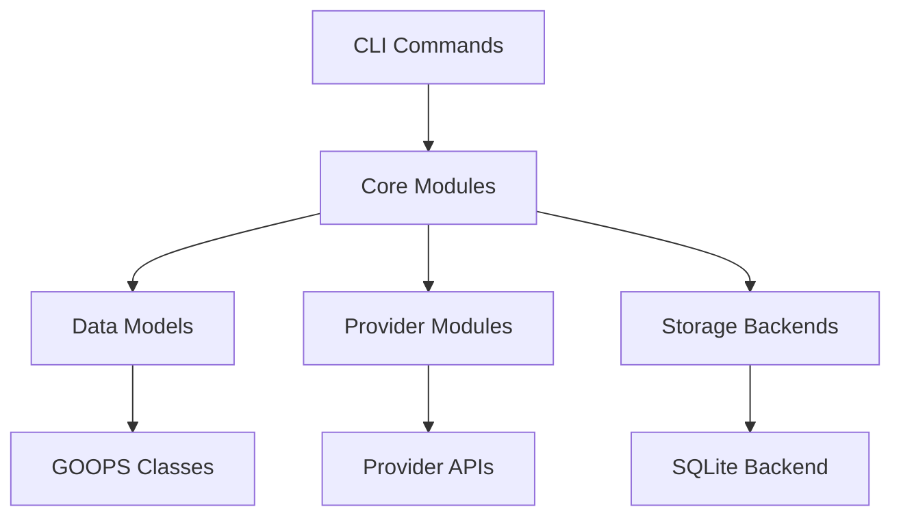

# Nimbus Development Guide

Comprehensive guide for developing and extending the Nimbus IAC Platform.

## Table of Contents

1. [Development Environment](#development-environment)
2. [Architecture Overview](#architecture-overview)
3. [Core Concepts](#core-concepts)
4. [Module Development](#module-development)
5. [Provider Development](#provider-development)
6. [Testing Strategy](#testing-strategy)
7. [Debugging Techniques](#debugging-techniques)
8. [Performance Optimization](#performance-optimization)

## Development Environment

### Setting Up Your Environment

```bash
# Clone with all submodules
git clone --recursive https://github.com/dsp-dr/guile-nimbus.git
cd guile-nimbus

# Create development branch
git checkout -b dev/your-name

# Install development dependencies
# FreeBSD
pkg install guile3 guile3-json guile3-gcrypt gmake inotify-tools

# Set up environment variables
cat >> ~/.bashrc << 'EOF'
export GUILE_LOAD_PATH="$HOME/guile-nimbus:$GUILE_LOAD_PATH"
export GUILE_AUTO_COMPILE=1
export GUILE_WARN_DEPRECATED=detailed
EOF

source ~/.bashrc
```

### IDE Setup

#### Emacs Configuration

```elisp
;; ~/.emacs.d/init.el
(use-package geiser-guile
  :ensure t
  :config
  (setq geiser-guile-binary "guile3")
  (setq geiser-guile-load-path '("~/guile-nimbus")))

(use-package paredit
  :ensure t
  :hook ((scheme-mode . paredit-mode)))
```

#### VS Code Setup

Install extensions:
- `vscode-scheme`
- `bracket-pair-colorizer`

Settings:
```json
{
  "scheme.implementation": "guile",
  "scheme.executablePath": "guile3",
  "files.associations": {
    "*.scm": "scheme",
    "*.nim": "scheme"
  }
}
```

## Architecture Overview

### Layer Architecture

```
┌─────────────────────────────────────┐
│           CLI Interface              │  <- User interaction
├─────────────────────────────────────┤
│         DSL Parser/Compiler          │  <- Configuration language
├─────────────────────────────────────┤
│        Execution Engine (DAG)        │  <- Orchestration
├─────────────────────────────────────┤
│      Provider Abstraction Layer      │  <- Resource management
├─────────────────────────────────────┤
│    State Management & Storage        │  <- Persistence
└─────────────────────────────────────┘
```

### Module Dependencies



## Core Concepts

### 1. State Management

State is the source of truth for managed infrastructure:

```scheme
(define-class <state> ()
  (id #:init-keyword #:id)
  (resources #:init-value (make-hash-table))
  (snapshots #:init-value '())
  (lock #:init-value #f))

(define-method (acquire-lock (state <state>))
  "Acquire exclusive lock for state modifications"
  ...)

(define-method (save-snapshot (state <state>))
  "Create point-in-time snapshot for rollback"
  ...)
```

### 2. Resource Lifecycle

```scheme
;; Resource states
(define-enum resource-status
  (pending    0)  ; Not yet created
  (creating   1)  ; Being created
  (active     2)  ; Successfully created
  (updating   3)  ; Being modified
  (deleting   4)  ; Being removed
  (deleted    5)  ; Removed
  (error      6)) ; Error state

;; Lifecycle hooks
(define-method (before-create (resource <resource>))
  "Pre-creation validation and setup")

(define-method (after-create (resource <resource>))
  "Post-creation configuration")
```

### 3. Dependency Resolution

```scheme
(define-class <dependency-graph> ()
  (nodes #:init-value '())
  (edges #:init-value '()))

(define-method (topological-sort (graph <dependency-graph>))
  "Return resources in dependency order"
  ...)

(define-method (detect-cycles (graph <dependency-graph>))
  "Check for circular dependencies"
  ...)
```

## Module Development

### Creating a New Module

1. **Define Module Structure**

```scheme
;; nimbus/feature/new-feature.scm
(define-module (nimbus feature new-feature)
  #:use-module (oop goops)
  #:use-module (ice-9 match)
  #:export (<new-feature>
            make-new-feature
            process-feature))
```

2. **Implement Functionality**

```scheme
(define-class <new-feature> ()
  (config #:init-keyword #:config
          #:getter feature-config)
  (state #:init-value 'initialized
         #:accessor feature-state))

(define (make-new-feature . args)
  "Factory function with validation"
  (let ((config (parse-args args)))
    (unless (valid-config? config)
      (error "Invalid configuration" config))
    (make <new-feature> #:config config)))

(define-method (process-feature (feature <new-feature>))
  "Main processing logic"
  (match (feature-state feature)
    ('initialized (initialize! feature))
    ('ready (execute! feature))
    ('completed #t)
    (_ (error "Invalid state"))))
```

3. **Add Tests**

```scheme
;; tests/test-new-feature.scm
(use-modules (srfi srfi-64)
             (nimbus feature new-feature))

(test-begin "new-feature")

(test-assert "create feature"
  (make-new-feature #:config '()))

(test-equal "process feature"
  'completed
  (let ((f (make-new-feature)))
    (process-feature f)
    (feature-state f)))

(test-error "invalid config"
  (make-new-feature #:config 'invalid))

(test-end "new-feature")
```

## Provider Development

### Implementing a New Provider

1. **Provider Interface**

```scheme
;; nimbus/providers/aws/provider.scm
(define-module (nimbus providers aws provider)
  #:use-module (oop goops)
  #:use-module (nimbus providers interface)
  #:export (<aws-provider>))

(define-class <aws-provider> (<provider>)
  (access-key #:init-keyword #:access-key)
  (secret-key #:init-keyword #:secret-key)
  (region #:init-keyword #:region))

(define-method (authenticate (provider <aws-provider>))
  "Authenticate with AWS"
  ...)

(define-method (validate-credentials (provider <aws-provider>))
  "Validate AWS credentials"
  ...)
```

2. **Resource Implementation**

```scheme
;; nimbus/providers/aws/ec2.scm
(define-module (nimbus providers aws ec2)
  #:use-module (oop goops)
  #:use-module (nimbus providers aws provider)
  #:export (<ec2-instance>
            create-instance
            terminate-instance))

(define-class <ec2-instance> (<resource>)
  (instance-type #:init-keyword #:instance-type)
  (ami-id #:init-keyword #:ami-id)
  (subnet-id #:init-keyword #:subnet-id))

(define-method (create-instance 
                (provider <aws-provider>)
                (instance <ec2-instance>))
  "Create EC2 instance"
  (let ((request (build-create-request instance)))
    (aws-api-call provider "RunInstances" request)))

(define-method (terminate-instance
                (provider <aws-provider>)
                (instance-id <string>))
  "Terminate EC2 instance"
  (aws-api-call provider "TerminateInstances" 
                `((InstanceIds . (,instance-id)))))
```

3. **API Integration**

```scheme
(define (aws-api-call provider action params)
  "Make authenticated AWS API call"
  (let ((signature (sign-request provider action params))
        (endpoint (provider-endpoint provider)))
    (http-post endpoint
               #:headers `((Authorization . ,signature))
               #:body (json->string params))))
```

## Testing Strategy

### Test Levels

1. **Unit Tests** - Individual functions/methods
2. **Integration Tests** - Module interactions
3. **Provider Tests** - Provider API mocking
4. **End-to-End Tests** - Full workflow validation

### Test Patterns

```scheme
;; Mock provider for testing
(define-class <mock-provider> (<provider>)
  (responses #:init-value (make-hash-table)))

(define-method (api-call (provider <mock-provider>) action params)
  (hash-ref (slot-ref provider 'responses) action))

;; Test with mock
(test-assert "create resource with mock"
  (let ((provider (make <mock-provider>)))
    (hash-set! (slot-ref provider 'responses)
               "CreateBucket" 
               '((BucketName . "test-bucket")))
    (create-bucket provider "test-bucket")))
```

### Coverage Analysis

```bash
# Run with coverage
GUILE_COVERAGE=1 make test

# Generate report
gcov nimbus/*.scm
lcov --capture --directory . --output-file coverage.info
genhtml coverage.info --output-directory coverage-report
```

## Debugging Techniques

### REPL-Driven Development

```scheme
;; Start REPL with history
$ rlwrap guile3 -L .

;; Load and reload modules
scheme@(guile-user)> (use-modules (nimbus core plan))
scheme@(guile-user)> (reload-module '(nimbus core plan))

;; Inspect objects
scheme@(guile-user)> ,inspect (make <state>)
scheme@(guile-user)> ,describe <state>

;; Trace execution
scheme@(guile-user)> ,trace (calculate-plan state config)

;; Time operations
scheme@(guile-user)> ,time (execute-plan plan provider)
```

### Logging

```scheme
(define *debug* (getenv "NIMBUS_DEBUG"))

(define (debug-log level message . args)
  (when *debug*
    (format (current-error-port) 
            "[~a] ~a: ~a~%"
            (current-time)
            level
            (apply format #f message args))))

;; Usage
(debug-log 'info "Processing resource ~a" resource-id)
(debug-log 'error "Failed to create: ~a" error-message)
```

### Error Handling

```scheme
(define-syntax with-error-handling
  (syntax-rules ()
    ((_ body ...)
     (catch #t
       (lambda () body ...)
       (lambda (key . args)
         (format (current-error-port)
                 "Error: ~a~%Details: ~a~%"
                 key args)
         (backtrace)
         #f)))))

;; Usage
(with-error-handling
  (create-resource provider resource))
```

## Performance Optimization

### Profiling

```scheme
(use-modules (statprof))

;; Profile function
(statprof
  (lambda ()
    (execute-plan large-plan provider)))

;; Profile with sampling
(statprof
  (lambda ()
    (process-resources resources))
  #:sample-frequency 1000)
```

### Optimization Techniques

1. **Lazy Evaluation**

```scheme
(define-syntax delay-force
  (syntax-rules ()
    ((_ expr)
     (let ((evaluated #f)
           (result #f))
       (lambda ()
         (unless evaluated
           (set! result expr)
           (set! evaluated #t))
         result)))))
```

2. **Memoization**

```scheme
(define (memoize proc)
  (let ((cache (make-hash-table)))
    (lambda args
      (or (hash-ref cache args)
          (let ((result (apply proc args)))
            (hash-set! cache args result)
            result)))))

(define expensive-calculation
  (memoize 
    (lambda (n)
      ;; Expensive computation
      )))
```

3. **Parallel Execution**

```scheme
(use-modules (ice-9 threads))

(define (parallel-map proc lst)
  (let ((futures (map (lambda (x)
                       (future (proc x)))
                     lst)))
    (map touch futures)))

;; Usage
(parallel-map create-resource resources)
```

## Best Practices

### Code Organization

1. **Single Responsibility** - Each module should have one clear purpose
2. **Clear Interfaces** - Export only necessary symbols
3. **Documentation** - Every public function needs a docstring
4. **Error Messages** - Provide context and suggestions

### Memory Management

```scheme
;; Use weak references for caches
(define cache (make-weak-value-hash-table))

;; Clean up resources
(define-method (cleanup (resource <resource>))
  (close-connections resource)
  (clear-cache resource))

;; Use guardians for finalization
(define guardian (make-guardian))
(guardian resource)
```

### Security

```scheme
;; Never log sensitive data
(define (sanitize-config config)
  (hash-filter (lambda (k v)
                (not (member k '(secret-key password token))))
              config))

;; Validate all inputs
(define (validate-input input schema)
  (match schema
    ('string (string? input))
    ('number (number? input))
    (`(enum . ,values) (member input values))
    _ #f))
```

## Continuous Integration

### GitHub Actions Workflow

```yaml
# .github/workflows/test.yml
name: Test
on: [push, pull_request]
jobs:
  test:
    runs-on: ubuntu-latest
    strategy:
      matrix:
        guile: ['3.0', '3.2']
    steps:
      - uses: actions/checkout@v2
      - name: Install Guile
        run: |
          sudo apt-get update
          sudo apt-get install -y guile-${{ matrix.guile }}
      - name: Run tests
        run: make test
      - name: Check coverage
        run: make coverage
```

## Resources

- [Guile Manual](https://www.gnu.org/software/guile/manual/)
- [SRFI Documentation](https://srfi.schemers.org/)
- [GOOPS Tutorial](https://www.gnu.org/software/guile/manual/html_node/GOOPS.html)
- [Nimbus Issues](https://github.com/dsp-dr/guile-nimbus/issues)